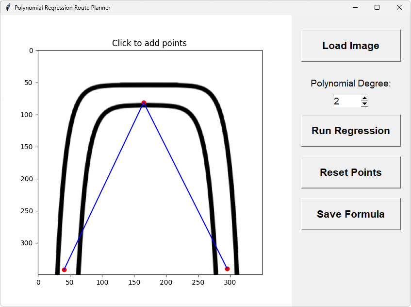
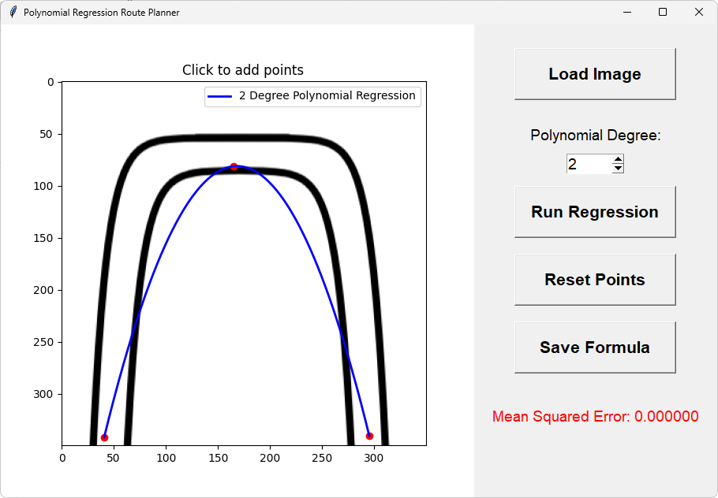

# 🚀 Polynomial Regression Route Planner

A Python app to interactively select points on an image and fit a polynomial regression curve through them.  
Built with **Tkinter** for GUI and **matplotlib** for visualization, implementing regression math manually in `libmath.py` (no external ML libraries).

---

## ✨ Features

- 🖼️ Load any image as background for route planning  
- 🎯 Add points by clicking on the image  
- 🎚️ Choose polynomial degree for regression (1 to 10)  
- ▶️ Run regression on demand and display the polynomial curve  
- 📊 Show Mean Squared Error (MSE) of the fit  
- 💾 Save regression formula to a text file  
- 🔄 Reset points and regression to start over

---

## 📸 Demo

### 1. Loading an image and selecting points



### 2. Polynomial regression curve fitted through points



### 3. Error and formula saved

```text
Polynomial regression formula:
y = 535.528 + -5.40133*x^1 + 0.0160519*x^2
````

---

## ⚙️ How to Run

1. Clone the repo
2. Make sure `libmath.py` and `app.py` are in the same folder
3. Install required packages if needed:

   ```bash
   pip install matplotlib numpy
   ```
4. Run the app:

   ```bash
   python app.py
   ```
5. Load an image or use blank background
6. Click on image to add points
7. Set polynomial degree
8. Click **Run Regression**
9. Save formula if you want

---

## 💡 Possible Future Improvements

* 🌐 Support for 2D regression (fit surfaces with multiple variables)
* 📷 Export regression plot as PNG/JPG image
* ↩️ Undo/redo point selection
* 📈 Show confidence intervals or error bars on curve
* 🎨 Improve UI/UX with more customization options
* 🗺️ Integrate real map data and GPS coordinates
* ⏱️ Add time or distance weighting for route optimization
* 📁 Export routes in GPX/KML or other formats

---

## 🛠️ Requirements

* Python 3.x
* `matplotlib`
* `numpy`
* `tkinter` (usually included with Python)

---

Made with ❤️ by **Berke Başaran** — Passionate about AI, math & software development
